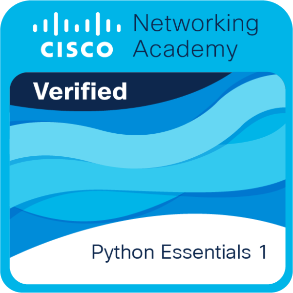
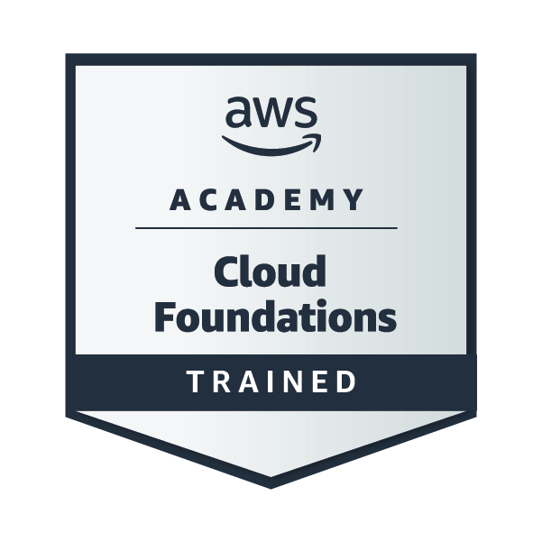

# Rodrigo Cuéllar Londoño

**Estudiante de segundo año de Desarrollo de Aplicaciones Web (DAW)** · Madrid

Me estoy formando como desarrollador desde la base: Java, Python, SQL y desarrollo web, con cursos oficiales y ejercicios propios. Además me gusta plantearme proyectos que se escapan de lo que ya sé, y aprender por el camino cómo se trabaja en un entorno más real y cómo sacar partido a los agentes de IA.

[LinkedIn](https://www.linkedin.com/in/rodrigo-cuellar-londono/)

---

## Formación y bases
- **Grado Superior en Desarrollo de Aplicaciones Web** · IES Gabriel García Márquez (en curso)
- **Grado Medio en Sistemas Microinformáticos** · IES Gabriel García Márquez
- **Python Essentials 1** · Cisco Networking Academy, con mis [ejercicios del curso](https://github.com/rodrigo27supr/Fundamentos-de-Python-1-Cisco)
- **AWS Academy Cloud Foundations**

---

## Proyectos

### [VexelByte](https://github.com/rodrigo27supr/vexelbyte-web) · en producción
Medio de noticias de hardware que se escribe solo: agentes de IA leen fuentes especializadas, contrastan cada noticia con otros medios y redactan el artículo citando sus fuentes.

**Cómo lo hice:** un proyecto que se escapa de mi nivel, para aprender a trabajar con agentes de IA en un entorno real. El código lo generó un agente; yo definí las reglas, audité cada entrega y elegí y configuré los servicios de despliegue.

`Java 21` `Spring Boot 4` `Astro 7` `PostgreSQL 18` `Docker` · [www.vexelbyte.com](https://www.vexelbyte.com)

### [LovaGame](https://github.com/rodrigo27supr/LovaGame)
Mi primer proyecto en Java: bot que consume APIs REST y avisa por Telegram, automatizado con GitHub Actions.

**Cómo lo hice:** escribí el código paso a paso yo mismo; la IA me sirvió de mentora para entender el porqué de cada parte.

`Java` `REST` `GitHub Actions` `Telegram`

### [LovaScaler](https://github.com/rodrigo27supr/LovaScaler)
Aplicación de escritorio que escala imágenes con IA (Real-ESRGAN), con procesamiento por lotes e interfaz moderna en modo oscuro.

`Python` `CustomTkinter` `Real-ESRGAN`

---

## Con qué trabajo
- **Lenguajes:** Java, Python, SQL, JavaScript
- **Desarrollo:** APIs REST, JSON, Spring Boot, Astro
- **IA:** agentes de IA (Gemini, Groq, OpenRouter) y desarrollo asistido con Claude Code
- **Herramientas y despliegue:** Git, GitHub Actions, Docker, Render, Vercel, Neon
